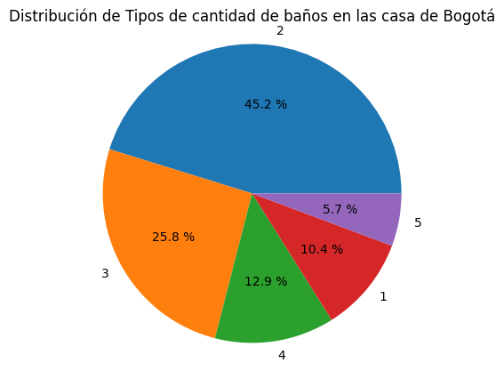
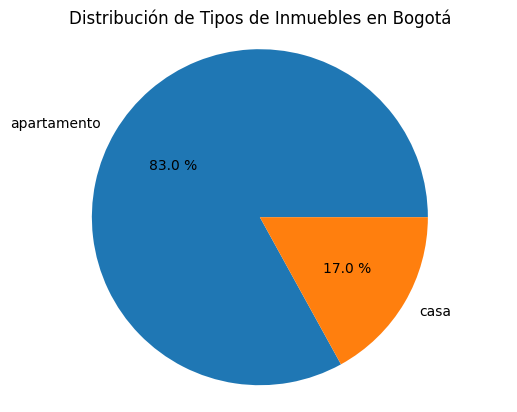
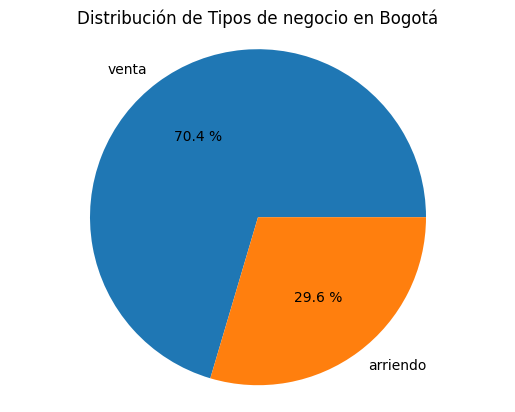
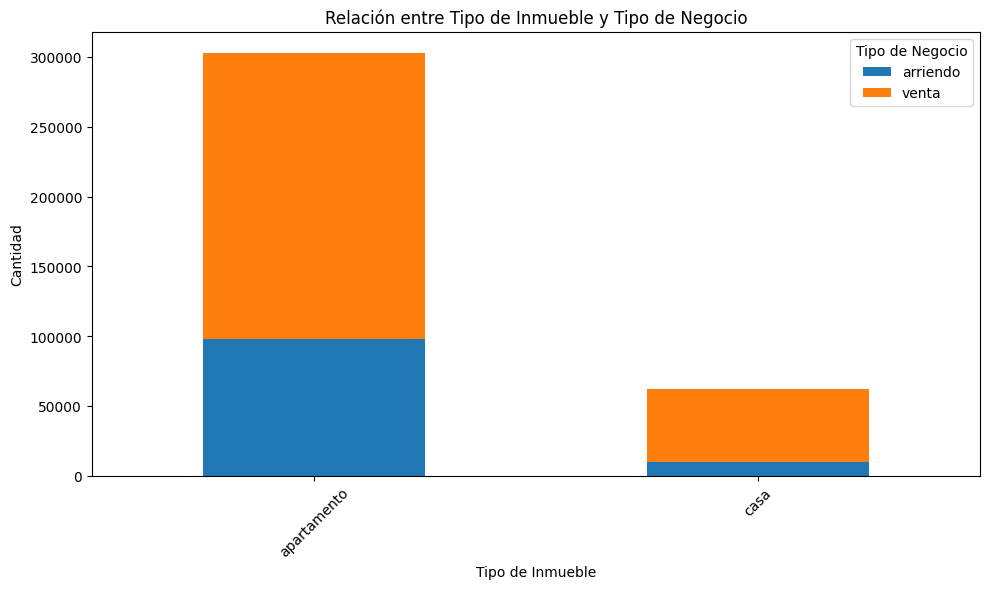
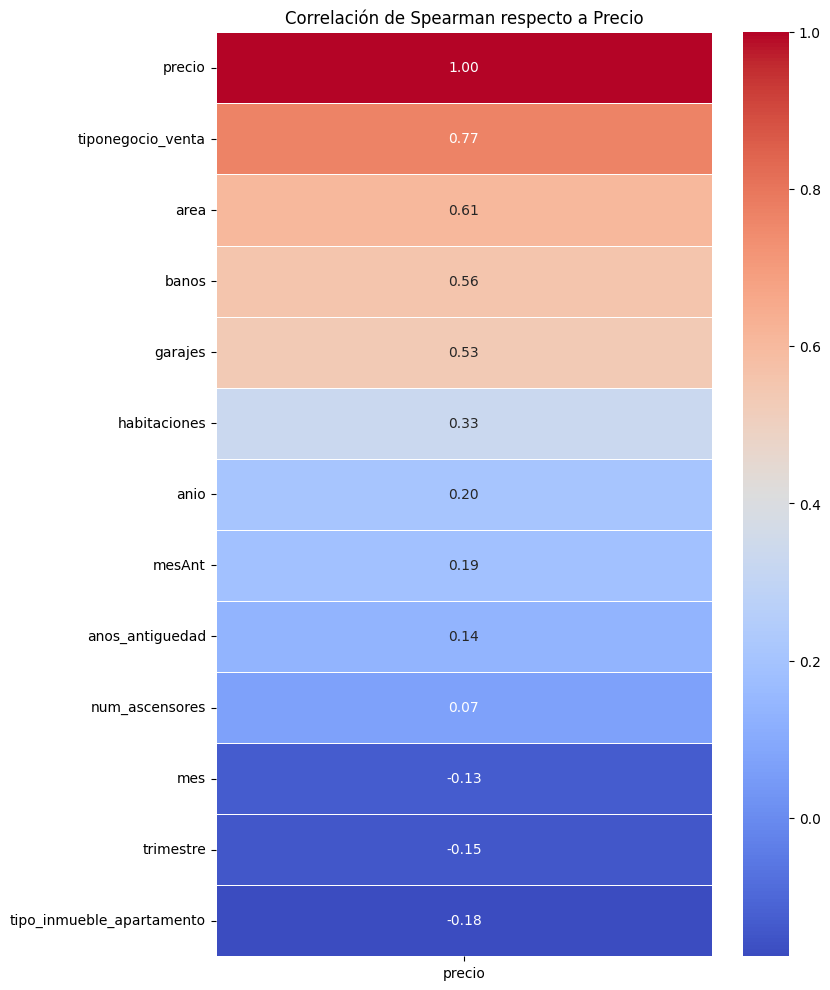
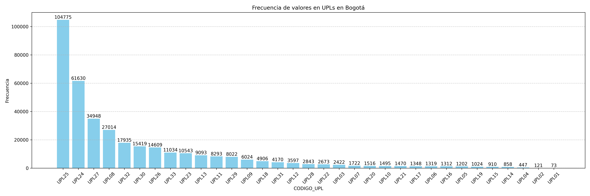
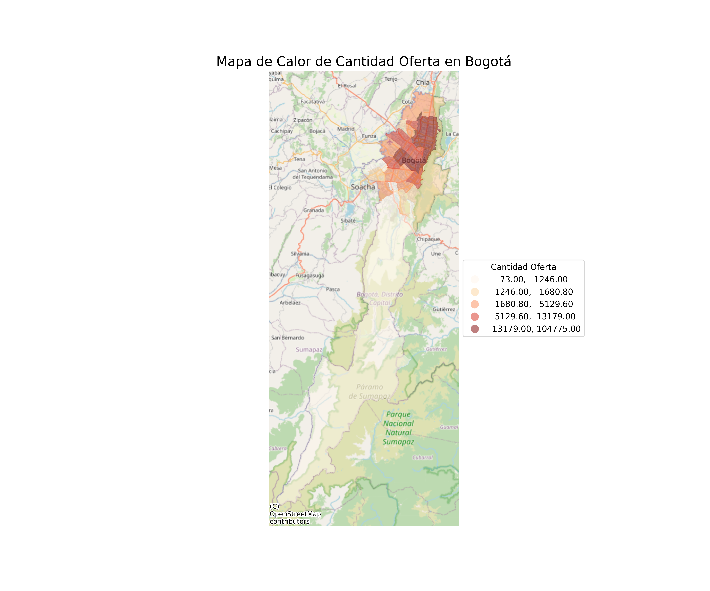
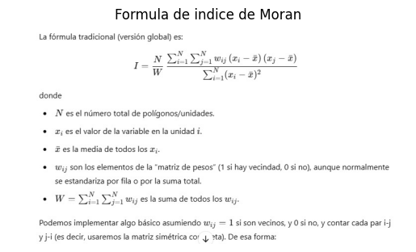

# Habi
prueba_habi

Este Documento describe el proceso para solucion de la prueba de Habi **extracion**, **Exploracion** , *Resultados exploracion**, **Modelo**, **Dificultades**, **Concluciones**.

---

## Tabla de Contenido
1. [Introducción](#introducción)  
2. [Objetivo](#objetivo)  
3. [Alcance y Definiciones](#alcance-y-definiciones)  
4. [Exploración y Evaluación de Datos (EDA)](#exploración-y-evaluación-de-datos-eda)  
   - [Calidad de Datos](#calidad-de-datos)  
   - [Estadísticos Descriptivos](#estadísticos-descriptivos)
5. [Resultados](#resultados)
6. [Notas](#notas)
7. [Conclusiones](#conclusiones)

---

## Introducción
En el marco de esta prueba tecnica se facilitan los link de acceso donde se debe tomar la informacion y dar solucion a los 6 puntos planteados, los cuales se resumen en crear un pipeline que extraiga la informacion de las fuentes y se ejecute sin necesidad de que quede en el disco. calcular cuántas ofertas inmobiliarias existen en Bogotá por UPL y permitir ver cuántas ofertas de inmuebles existen por UPL. luego hacer una i de Moran para saber las UPLs HH, HL, LH y LL según el modelo para el valor por m2 de los inmuebles por UPL como paso siguiente hacer el modelo de predicción de precios de su preferencia para valorar los inmuebles proporcionados y presentar el MAPE y RMSE del resultado.

El contenido de esta carpeta esta compuesto de la siguiente forma:
1. Data, alli descargara algunos archivos que llega a necesitar.
2. Imagenes: esta contiene las imagenes generadas por el codigo.
3. habi: contiene archivos de la realizacion de algunas pruebas y graficas realizadas con Qgis
4. Scrip este contien el scrip que contiene el desarrollo de los puntos planteados, sus graficas y notas. el codigo tiene como nombre Prueba_Data_Science_solver.ipynb
   
---
## Objetivo
Generar un pipeline de descarga y ejecucion automatico.
Identificar cuantas oferttas inmoviliares existen por upl en Bogota, y graficar.
Ver el indice de mora y lisa para Bogota por precio y ver si hay correlacion espacial.
Generar un modelo para predecir los precios de las viviendas.

---
## Alcance y Definiciones
- **EPSG** las EPSG  4686 es la proyectada y la 4326 es geografica y la 3116 esta en metros

---

## Exploración y Evaluación de Datos (EDA)
Durante esta fase, se realizaron **descriptivos** y **validaciones** de calidad para comprender el comportamiento de los datos.

### Muestreo de los Datos
Se trabajó para los primeros puntos se trabajo con el total de los datos pero por capacidad de procesamiento y tiempo de ejecucion 
en la parte del eda solo se trabajo con una muestra para la prueba y para el resultado del indice de moran se trabajo solo con el codigo upl 18. 

### Calidad de Datos
1. **Valores Nulos / Faltantes**  
   - Si identificaron valores nulos a nivel de registro. a demas de identificacion de duplicados en las variables
   - algunos se corriguieron otras variables se omitieron dado que no trabajariamos con ellas.

3. **Consistencia en fechas**
   - Rango de fechas plausibles (Fecha mínima: 2020-04-14, Fecha máxima: 2022-07-16)

### Estadísticos Descriptivos
- **Se encintraron las siguientes distribuciones para la cuidad de bogota, referentes a inmuebles**

- Esto nos genera una idea de como estan las habitas en bogota, donde el 80% de las habitas tienen entre 2 y 3 baños.
- El 70.4%  de los inmuebles en Bogota en este dataset estan para la venta y el 29.6% estan para arrendar. y el 83% de estos inmuebles son apartamento.
- 

- Para antes de generar el modelo se tuvo que mirar como es la correlacion dde las variables respecto a nuestra variable target en este caso precio, su correlacion con spearman es la de la siguiente grafica, donde se debieron omitir en un principio las de muy alta correlacion y de correlacion casi nula
  

---

## Resultados
Acontinuacion se muestra un resumen visual de algunos de los puntos de interes.
- Dado la capacidad de procesamiento se trabajo con la UPL18, Donde el Moran's I observado es: 0.026779042642575197 y el p-value aproximado: 0.001.
- Dado los resultados para la UPL18 vemos el valor observado del indice de moran indica una autocorrelacion espacial debil, lo que significa que no hay una fuerte tendencia a quevalores similares(altos o bajos) esten agrupados espacial,emte, adicionalmente, el p value  indica significancia estadistica  del indice de moran, en otras palabras indica que hay evidencia para sugerir que existe algun tipo de patron espacial en los datos.

- A continuacion se muestra la Frecuencia_upls_bogota en la cual tenemos como es su distribuciones de frecuencia y vemos que la UPL25 es la mas frecuente con mas de 104775 valoes en la ciudad de bogota.

- Aqui tenemos un mapa de calor  para esa la cantidad de ofertas en bogota.

---

## Notas
- Dado algunas incompatibilidades entre las librerias numpy, sklearn, fue necesario generar el indice de moran de forma manual basandonos en su formula, la cual parte de ella se muestra en la siguiente imagen.

- Se hace necesario pasar por diferentes EPSG para que los datos espaciales crucen de mejor manera.

--- 
## Conclusiones

### 1. Generacion de Pipelines.
   - Se observa en el codigo Prueba_Data_Science_solver que es posible leer las bases desde las fuentes sin necesidad de descargarlas o tenerlas guardadas en el disco.
### 2. Generacion de Modelo.
   - Se hace una exploracion y limpiesa previa de las variables y verifica que variables son o no de importancia, antes de iniciar el modelo
   - Se ajusta lo mas posible la grilla de hiper parametros y escoge las variables con mayores estadisticas para la prediccion de modelo, aunque este no fue excelente hay muchas mas    posibilidades de mejora con otros modelos como xgboost o redes neuronales. o introduciendo mas variables de importancia.
   - se hace un analisis dentro del modelo para ver que tanta importancia tiene la variable tiempo en el y se observa que se puede omotir y los resultados seran los mismos.
### 3. Generacion de Indice Moran.
   - Se observa una correlacion espacial debil pero significativa. esto nosda una idea de que la correlacion espacial puede aumentar al tomar toda la base pero no va a umentar mucho esta correlacion espacial de precio de vivienda.
### 4. Sugerencias.
   - Se suguiere estos temas espaciales trabajar en Azure o AWS, esto por su alto consumo en memoria y tiempos, asi con estos des ambientes de desarrollo esto se resolveria en parte.
   - Otra sugerencia para graficas y analisis de modelos espaciales es trabajar arn Arcgis-pro, y si gusta una conbinacion de Arcgis_pro con python para una automatizacion. y automatizar con Airflow o Datafractory.
   - Para una mejora y automatizacion en los modelos Se suguiere Trabajar con MLFlow- Databricks de AZure.

